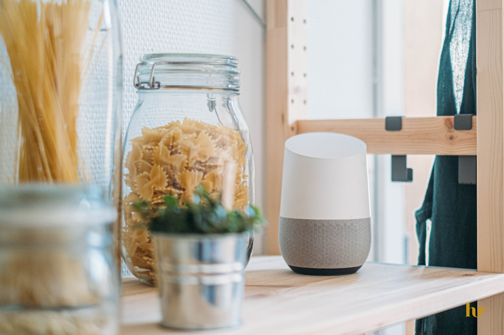

# Google’s Home Assistant will soon be getting a sense of smell
**Your home assistant will soon be getting an update ... as Google unveil a new and improved version of their smart home assistant.**

*The caption of the image.*

Bob tiersy, director of Google hardware said in a statement that «In an effort to harvest as much data as we can from our users, the next logical thing to do was to not just be able to hear and see what’s going on in people’s home but also be able to smell».

This new update will allow Google to target people based on their dietary habits, hygiene levels, pets, cigarette smoke. For exemple, it might suggest you a new brand of perfume if you happen to stink. Remind you to empty your cat litter box or create reminders to Take out the trash.

This new capability is made possible by their newly developed olfactory sensor.

Devices released after may 2015 are already equipped with this capability. An over the air update will soon be released to enable the feature. The company says it will pay customers with older devices to receive the upgrade.
