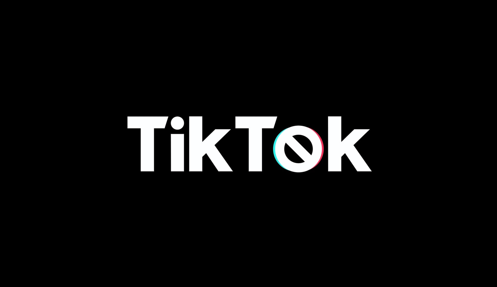

# US Wields Ban Hammer At China Over Who Gets To Spy On TikTok Users

**WeWork explores a nostalgic niche to leave their recent IPO disaster behind.**

<!--lede here-->

*Beijing-based app TikTok has over 70M US users*

With President Donald Trump calling the global Covid-19 crisis the "Chinese virus" for months now, we can't ignore the increasing divide between the US and China. After the Trump administration announced on Fox News to outlaw Chinese apps, TikTok is now officially a national security risk. 

> "We don't care about privacy, actually, we are very excited that the app has reached 70M users in the US. All we care about is for that data to be in American hands." —Mike Pompeo, Secretary of State 

Trump said "The ban is the best of my many many good ideas to punish China for giving us their virus." Framing it as a national security issue was the FBI's contribution to the idea.

FBI director Christopher Ray even confirmed that announcing the ban is a strategy for them to blackmail the app's parent company ByteDance into sharing access. "Once we get our hands on that goldmine, we can safely stop calling it a security threat."

Trump also suggested in a tweet that the ban is partly due to the responsibility TikTok played in the all-time low attendance at his June Tulsa Rally. "What a tremendous insult to my party. TikTok did it. TikTok has to go."
