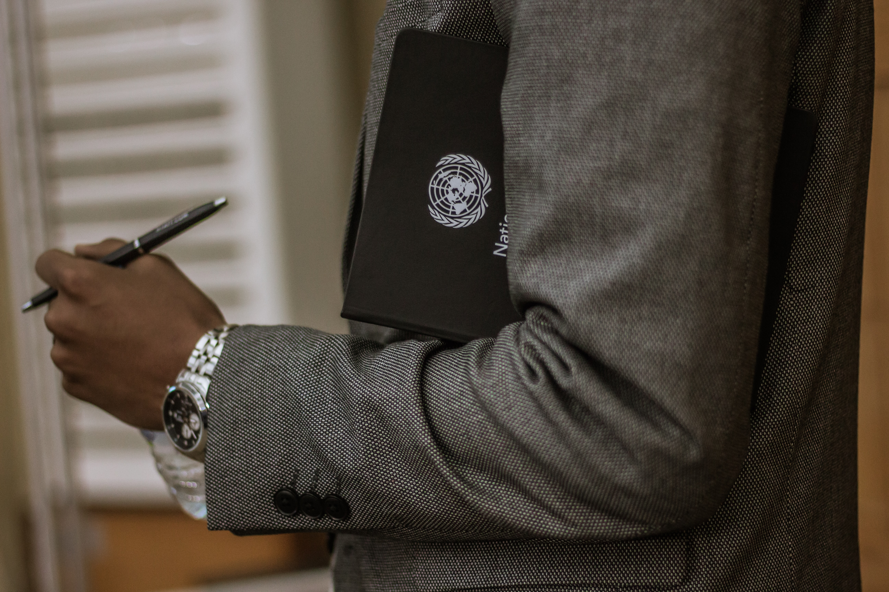

# Gig Economy Companies Lobbying To Exclude Workers From The Declaration of Human Rights

**A global group of gig economy companies petitioned the United Nations to honor their demand.**

*A network of lobbyists from the US, Canada, the UK, France, Germany, India and Australia have reportedly been working on this case.*

A group of more than 45 platform economy companies have reportedly signed an alliance in joined efforts to ostracize their fleets of gig-workers from The Universal Declaration of Human Rights.

> "We're really aiming to detach ourselves from this workforce. We can't legally assume the responsibility of having that many peasants on our hands." —Andrew Macdonald, SVP Global Rides and Platform at Uber

The global group, which includes Lyft, Uber, Instacart, Amazon Flex and TaskRabbit, is undergoing the hefty procedure of amending the International Human Rights Law. They claim to want to modify the 72 year old Law in order to preclude their fleet of workers from being recognized as human beings.

> "Our bigger vision is to shift this class of laborers towards the realm of robots. Think, like vending machines." —Dave Clark, SVP, Worldwide Operations at Amazon

Feeling the pressure from the various communities of on-demand workers and their threats of unionizing, the group of companies has recently shifted gears and turned to the international community.

After multiple reported lobbying activities with their respective countries' parliaments, the group has just officially appealed to the United Nations. Secretary-General of the UN Mr. António Guterres has stated a first reading will be held in the New York City UN headquarters in 2021.
